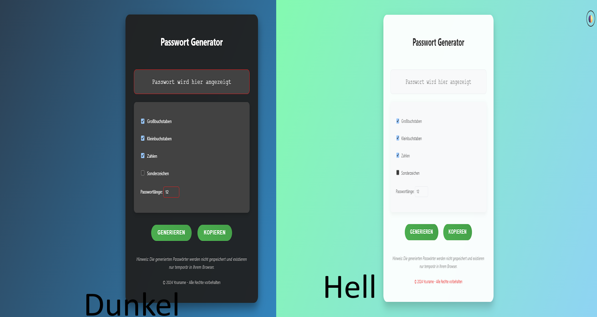

---

# 🔐 Passwort Generator – HTML Formular

Ein einfacher Passwort-Generator mit HTML, CSS  Benutzer können ein sicheres Passwort generieren lassen, indem sie Kriterien wie Länge, Groß-/Kleinbuchstaben, Zahlen und Sonderzeichen auswählen.

## 📧 Support

**Braucht ihr Hilfe? Kein Problem!**

📨 E-Mail: [Hilfe@junixfx.de](mailto:Hilfe@junixfx.de)
🌐 Discord-Server: [https://discord.gg/fUWBR2ym2f](https://discord.gg/fUWBR2ym2f)

## 📸 Vorschau



## 🚀 Funktionen

* Benutzerdefinierte Passwortlänge
* Ein-/Ausschalten von:

  * Großbuchstaben
  * Kleinbuchstaben
  * Zahlen
  * Sonderzeichen
* Kopieren des generierten Passworts in die Zwischenablage

## 🛠️ Technologien

* HTML5 + CSS3 in Einen !

## 📂 Projektstruktur

```
passwort-generator/
├── index.html
└── README.md
```

## ✅ So benutzt du es

1. Lade die Dateien herunter oder klone das Repository:

   ```bash
   git clone https://github.com/JunixcodingFx/Passwort-Generator.git
   ```
2. Öffne die `index.html` Datei in deinem Browser.
3. Wähle die gewünschten Optionen aus.
4. Klicke auf „Passwort generieren“.

